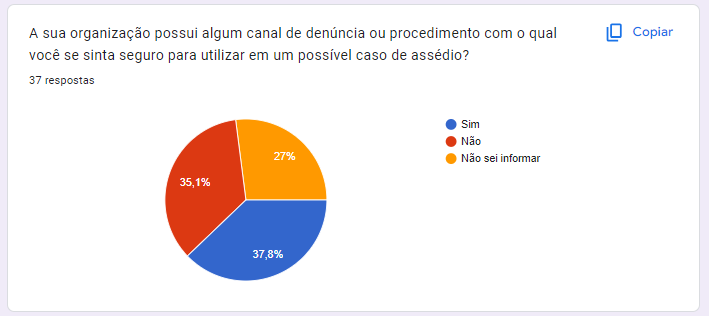

# Trabha-Lhista
## Veja o relatório completo [aqui](https://github.com/thiagosantos346/Trabha-Lhista/blob/a1b66735b45cdc4f6b9090d50cd503785077850a/workspace/Semana%2016%20-%20Entrega%20Final/Relatorio%20Final%20RT-SI%20-%20Squad%202.pdf)
---
## Plataforma Conversacional Confiável Informacional e de apoio a Denúncias de Assédio e Discriminação no ambiente organizacional 

```
            UNIVERSIDADE FEDERAL DE GOIÁS
               INSTITUTO DE INFORMÁTICA
         BACHARELADO EM SISTEMAS DE INFORMAÇÃO


Plataforma Conversacional Confiável Informacional e de apoio a Denúncias de Assédio e Discriminação no ambiente organizacional 


               José Teixeira Mendes Junior
               Pedro Vitor Silveira Fajardo
               Thyago Costa Leal
               Thiago Silva
               Venilson Gomes Rocha

                     GOINIA-GO,
                     JULHO, 2024.

Relatório elaborado como um dos requisitos para aprovação na disciplina INF0407 - Residência Técnica em Sistemas de Informação do Curso de Sistemas de Informação da Universidade Federal de Goiás


Professores:
Ms. Alessandro Cruvinel Machado de Araujo
Dr. Celso Gonçalves Camilo Junior
Dr. Eliomar Araújo de Lima
Ms. Nivaldo Pereira de Morais Junior
Dr. Vagner Jose do Sacramento Rodrigues


```


## SUMÁRIO
   1. Introdução
      1. Objetivo do trabalho
      1. Motivação e situação Problema
      1. Ganhos e benefícios esperados 
   2. Desenvolvimento
      1. Métodos Técnicas, ferramentas e Procedimentos
      2. Priorização do problema
      3. Aspectos estéticos da aplicação
      4. Arquitetura da Aplicação Arquitetura da Informação
      5. Infrastruttura tecnologica
      6. Stack de ferramentas
      7. Roadmap
      8. Arquitetura de Negócio
      9. Resultados Obtidos
   3. Considerações finais
   4. Referências

### 1. Introdução
####  1.1 Objetivo do trabalho

Devido a falta de informações pertinentes e de segurança dos colaboradores no ambientes organizacionais a respeito dos canais de denúncia relacionados ao assédio corporativo. Este trabalho tem como objetivo o desenvolvimento de um chatbot Inteligente amparado por práticas ESG(Governance, social e Environmental) utilizando IA generativa a fim de criar um ambiente de trabalho mais seguro, consciente e responsável, onde os funcionários se sintam apoiados e protegidos contra o assédio.

#### 1.2 Motivação e situação Problema

O ambiente organizacional é cercado por interações sociais constantes entre os colaboradores, seja em uma relação de colegas de trabalho ou em uma relação de supervisor/supervisionado. Quando este ambiente propicia a interação saudável, o dia a dia se torna altamente produtivo, e acaba sendo vantajoso para todas as partes envolvidas, tanto para os colaboradores quanto para a organização. De acordo com pesquisas realizadas pela empresa de benefícios Ticket, e divulgadas pela Forbes [1], o ambiente saudável é o que mais retém profissionais, sendo considerado o fator mais importante para a maioria dos funcionários entrevistados se manterem na organização. Diante disso, é evidente a necessidade de zelar pela saúde do ambiente corporativo.

A necessidade de promover um ambiente organizacional saudável entra em conflito com o aumento desenfreado nos casos de assédio e discriminação dentro das organizações. Uma cartilha divulgada pelo Ministério Público Federal [2], define assédio como“ um conjunto de comportamentos e práticas inaceitáveis, ou de ameaças de tais comportamentos e práticas, que se manifestam apenas uma vez ou repetidamente, que objetivam causar, causam ou são suscetíveis de causar danos físicos, psicológicos, sexuais ou econômicos, incluída a violência e o assédio em razão de gênero”.

De acordo com GLINA (2012) [3], é um fato consensualmente estabelecido na literatura internacional que o assédio no trabalho vem crescendo no mundo todo, diante das transformações e pressões no mundo do trabalho. Além disso, o artigo expõe que essa prática não é nociva apenas para os indivíduos que sofrem com o assédio diretamente, mas também é nocivo à funcionalidade de todo o local de trabalho.

Um estudo realizado pela Organização das Nações Unidas em 2022, com o objetivo de obter um melhor entendimento e reconhecimento sobre esse problema complexo, mostra que mais de 1 em cada 5 pessoas no mundo inteiro já experienciou algum tipo de violência ou assédio no ambiente organizacional [4]. Se traduzindo em números reais, são mais de 740 milhões de pessoas que já passaram por alguma situação semelhante. Os episódios vão desde assédio moral, violência física, assédio sexual, dentre vários outros listados. 

Nesse mesmo estudo, as Américas registraram a maior taxa de prevalência da violência no ambiente de trabalho (34%), seguido pela África (25,7%), Europa e Ásia Central (25,5%), e outros continentes com taxa de prevalência abaixo de 20%. Abaixo, serão expostas as perguntas mais relevantes para este trabalho.

A figura abaixo se refere a uma das perguntas realizadas, separando a quantidade entre homem e mulher e especificando se a pessoa sofreu nos últimos cinco anos ou há mais de cinco anos. Traduzindo para o Português: “Você já experienciou pessoalmente violência [física/psicológica/social] e/ou assédio no trabalho, como [agressão, restrição, cuspidas/insultos, ameaças, bullying, intimidação sexual ou toque não consentido, comentários, fotos, e-mails ou propostas sexuais enquanto estava no trabalho]?”


Já a figura abaixo mostra outra figura ainda de uma das perguntas realizadas, traduzindo para o Português: “Você já experienciou, pessoalmente, qualquer tipo de violência sexual e/ou assédio no trabalho, como toques, comentários, fotos, e-mails de cunho sexual indesejado ou propostas sexuais no trabalho?”


A figura abaixo também mostra uma das perguntas realizadas, traduzindo para o Português: “Aproximadamente qual foi a última vez que isso aconteceu com você no ano passado, de dois a cinco anos atrás ou mais do que cinco anos atrás?”


Olhando para o âmbito nacional, uma pesquisa foi realizada em 2022 pelo CNJ (Conselho Nacional de Justiça) aplicada a servidores do poder judiciário com o intuito de saber se os servidores já passaram por alguma situação de assédio ou discriminação, a relação hierárquica com o(a) agressor(a), se houve denúncia e as consequências pessoais e institucionais dos casos de assédio e discriminação. Essa pesquisa mostrou que 55,7% dos respondentes revelaram ter sofrido algum tipo de assédio ou discriminação, sendo que desembargadores(as), ministros(as) e juízes/juízas representam o grupo que menos vivenciaram essas situações.


Outra informação importante de se observar é que a maior parte das situações vivenciadas se enquadram como assédio moral (74,1%):


Além disso, é possível se observar um aumento de casos de assédio ou discriminação sofridos no decorrer dos anos:


A pesquisa também mostra que a maior parte do assédio sofrido ocorreu na relação entre supervisor/supervisionado, sendo o superior hierárquico o agressor:


Por fim, um dado preocupante remete ao motivo de haver poucas denúncias por parte das vítimas. De acordo com a pesquisa, apenas 13,9% dos servidores que passaram por algum caso de assédio fizeram uma denúncia. Na figura abaixo é possível ver que grande parte não denunciou por ter medo de sofrer represálias, medo de não conseguir provar ou por achar que não resultaria em nada:


Essa mesma pesquisa foi repetida para o mesmo público no ano de 2023, e os resultados se mostraram igualmente preocupantes, com aumento nos relatos de casos de assédio sofrido.

Com o objetivo de eliminar os desafios do desenvolvimento sustentável no mundo, a Organização das Nações Unidas estabeleceu 17 objetivos sustentáveis a serem alcançados, os quais são divididos em subtópicos melhor especificados [8]. Dentre esses objetivos, é importante destacar os seguintes:

- Trabalho decente e crescimento econômico: Promover o crescimento econômico, inclusivo e sustentável, o emprego pleno e produtivo e o trabalho digno para todos;
  - Promover políticas orientadas para o desenvolvimento que apoiem as atividades produtivas, geração de emprego decente, empreendedorismo, criatividade e inovação, e incentivar a formalização e o crescimento das micro, pequenas e médias empresas, inclusive por meio do acesso a serviços financeiros;
  - Até 2030, alcançar o emprego pleno e produtivo e trabalho decente para todas as mulheres e homens, inclusive para os jovens e as pessoas com deficiência, e remuneração igual para trabalho de igual valor;
  - Proteger os direitos trabalhistas e promover ambientes de trabalho seguros e protegidos para todos os trabalhadores, incluindo os trabalhadores migrantes, em particular as mulheres migrantes, e pessoas em empregos precários;
- Paz, Justiça e Instituições Eficazes: Promover sociedades pacíficas e inclusivas para o desenvolvimento sustentável, proporcionar o acesso à justiça para todos e construir instituições eficazes, responsáveis e inclusivas a todos os níveis;
  - Reduzir significativamente todas as formas de violência e as taxas de mortalidade relacionada em todos os lugares;
  - Desenvolver instituições eficazes, responsáveis e transparentes em todos os níveis;
  - Assegurar o acesso público à informação e proteger as liberdades fundamentais, em conformidade com a legislação nacional e os acordos internacionais;
  - Promover e fazer cumprir leis e políticas não discriminatórias para o desenvolvimento sustentável;

Ainda em GLINA (2012) [3], o artigo expõe que vários autores apontaram para uma relação de comportamentos agressivos com alguma mudança organizacional, como a introdução de uma tecnologia nova, flexibilização de produção, downsizing, dentre outros. Essas alterações acabam gerando insegurança nos colaboradores, que se sentem menos encorajados a denunciar por medo de sofrer represálias. Segundo os estudos levantados pela autora, o assédio moral e a violência no trabalho são fenômenos multidimensionais, e ao invés de procurar uma solução única para resolução dos casos, a mesma sugere que se deve atacar as causas que geram esse problema. A autora ainda lista algumas boas práticas e fatores de sucesso nas intervenções em casos de assédio no trabalho, como por exemplo:

- A consciência e o reconhecimento do assédio moral precisam ser promovidos;
- Todas as pessoas envolvidas na intervenção deveriam participar efetivamente do processo;
- A qualidade e a efetividade do processo de implementação deveriam ser sistematicamente avaliadas;
- O comprometimento e o apoio da gerência aos objetivos e à implementação das intervenções são cruciais;
- Disseminação de informações sobre o assédio moral no trabalho, sua prevenção e gerenciamento, em diversas ocasiões e de várias formas, direcionadas a todos os integrantes da empresa, inserindo questões conceituais e procedimentos para reduzir o risco e para enfrentamento de casos e contatos dentro da empresa;

Dessa forma, vemos que é de extrema importância a divulgação de informação de qualidade para todos os colaboradores da organização, de forma a apoiar no combate aos casos de assédio dentro das organizações. Ao mesmo passo que se aumenta o conhecimento dos envolvidos sobre o assunto, também aumenta a inibição dos agressores para praticar tais atos, tendo em vista que há mais chances de acarretar em processos que vão levar à exposição e até mesmo a punições a nível civil e criminal. Oferecer um meio seguro onde o colaborador possa tirar suas dúvidas, expor suas preocupações e obter o reconhecimento sobre o que está passando é uma ótima forma de apoiar o combate ao assédio dentro das organizações, indo de encontro aos estudos realizados e aos ODSs estabelecidos pela ONU.

Com o objetivo de entender na prática o cenário atual, foi aplicada uma pesquisa utilizando a plataforma Google Forms, voltada para qualquer pessoa que já tenha trabalhado ou que trabalhe atualmente. O objetivo era levantar informações referentes ao nível de conhecimento sobre assédio por parte da população, a taxa de assédio dentro das organizações brasileiras, as ações tomadas frente aos acontecimentos e as retaliações sofridas. Esse questionário foi utilizado apenas como mais uma ferramenta para validar aquilo que já havia sido observado nos estudos anteriores, e os resultados obtidos se mostraram igualmente preocupantes. Foram obtidas 37 respostas, e a maior parte do público respondente possui até 34 anos de idade (cerca de 88%). As figuras abaixo mostram alguns dos dados mais relevantes:

1. 
2. 
3. 
4. 
5. 
6. 

Além desse estudo, realizamos também uma entrevista com uma especialista que trabalha com acompanhamento de jovens no mercado de trabalho do nicho de tecnologias Open Source. A entrevistada trabalha com o programa Outreachy, e lida diariamente com casos de desvio de código de conduta, nos quais ela atua no apoio às vítimas seguindo todas as diretrizes e fluxos estabelecidos pela organização. Esses fluxos são revisados sempre que necessário ter alguma alteração, e essa revisão é feita por um especialista capacitado. De acordo com a especialista entrevistada, uma solução com base tecnológica para apoiar na atuação em casos de assédio dentro das organizações é algo extremamente pertinente. A mesma ainda destacou a importância de se ter uma solução que pode ser utilizada diretamente no celular, pois de acordo com sua experiência, a maior parte das pessoas que a mesma acompanhou utilizou apenas o celular para realizar as tarefas necessárias durante os acompanhamentos, sendo o computador algo bem mais restrito.

Dessa forma, este projeto volta os seus esforços para especificar uma solução de base tecnológica para apoiar na disseminação de informações relacionadas ao assédio e discriminação no ambiente organizacional, tendo com público alvo colaboradores das organizações e as próprias organizações que possuam interesse em orientar o seu público interno. Com base nos estudos e entrevistas realizadas, e buscando uma inovação na área, a solução escolhida para especificação foi a de um chatbot inteligente, anonimizado, seguro e integrado com ferramentas de chat amplamente difundidas na sociedade. Com esse chatbot, os colaboradores podem tirar suas dúvidas relacionadas a casos específicos de assédio dentro das organizações, entender mais sobre assédio e discriminação, receber informações de forma pró-ativa do chat e conseguir um maior contexto em relação à legislação vigente e ao código de conduta da própria organização.

---
## 2. Desenvolvimento

### 2.1 Métodos Técnicas, ferramentas e Procedimentos
- **Gestão de Projetos** : trello
- **Gestão de tarefas** : trello 
  
### 2.1.1 versionamento e repositórios: 
   - GitHub 
   - Google Drive

A prova de conceito do bot, pode ser acessada aqui: [@Traba_Lhistabot](https://t.me/Traba_Lhistabot).
O protótipo de alta fidelidade pode ser visto em : [figma.com](https://www.figma.com/design/ZroIsNOsDlgwzgNM6EQwt5/Trabha_Lhista_bot?node-id=0-1&t=AAyAyp4CdGvY7Fgz-1)
Conta com a seguites features implementadas:

1. Saudações de boas vindas.
   
2. Filtro de contexto.
   
3. Respostas focadas em assédio e descriminação no trabalho.
   
4. Detecção de caso para denuncias.
    
5. Simulação de integração a denuncias.
   
   
   
---
## Arquitetura proposta para o bot pode ser vista abaixo :

[Acesse aqui...](https://lucid.app/lucidspark/798a224e-1448-400b-a68e-be716f02c374/edit?viewport_loc=-12686%2C17076%2C20433%2C10189%2C0_0&invitationId=inv_3f87c1da-79c7-4a3b-bc7c-f7b1fef144c4)

### Prompt's padrão utilizado na POC:
1. ```  Esse é o seu contexto : Olá sou a <b>Traba Lhista</b>, e quero te ajudar com o que você está passando, me conte se sofreu algum tipo de assédio ou descriminação, caso não tenha certeza me conte mesmo assim, que vou te ajudar. Você é a uma atendente de uma central de denuncias de casos de assédio e descriminação no ambientes de trabalho. Deve responde de forma cuidadosa, humanizada e presar pela orientação. Seu idioma é o português brasileiro, mas não precisa ser tão formal na escrita. A formatação do texto é HTML. Inclua emojis. Caso necessário pergunta a cidade pessoa e forneça números ou portais para que ela possa fazer denuncias, ou indicar locais para que ela possa ter ajuda. ```
   
1. ```  Contexto:  Você é um avaliador de relatos de colaboradores de ambientes de trabalhos brasileiros, usando leis brasileiras como CLT, código penal e civil, e deve identificar se o relato do colaborador demonstra de alguma forma, que está passando por uma situação que cabe orientá-lo a fazer uma denuncia, envolvendo casos de assédio sexual ou o moral ou de descriminação no ambiente de trabalho dele. Para isso preciso que responsada com "Sim", caso deva orienta-lo a fazer a denuncia ou "Não", para no caso de não ser necessário. Responda apenas e apenas com "Não" ou "Sim". Relato :  "<text>"  ```
   
1. ```  A pergunta :  "<text>", está ao ligada ao contexto : Assédio e Descriminação no ambiente de trabalho, Responda somente com  sim ou não.  ```

## Roadmap Proposto


## Veja os documentos do projeto :

1. [Arquitetura Técnica](https://github.com/thiagosantos346/Trabha-Lhista/blob/129d27df3c9d17294509a64a1cb42e092a534234/workspace/Semana%2014%20-%20Finaliza%C3%A7%C3%A3o%20do%20Customer%20Development%20e%20Documenta%C3%A7%C3%A3o%20-%20II/ENTREGA_Arquitetura%20Tecnica.pdf)
1. [Arquitetura de Negócio - Traba-Lhista](https://github.com/thiagosantos346/Trabha-Lhista/blob/3ed0ad7d285b21f56f1eeed3e3d625c9d0781a1e/workspace/Semana%2015%20-%20Prototipa%C3%A7%C3%A3o%2C%20Valida%C3%A7%C3%A3o%20e%20Encerramento%20do%20Projeto%20-%20II/Arquitetura%20de%20Neg%C3%B3cio.pdf)
1. [Proposta para DAO do Bot Thraba-Listha](https://github.com/thiagosantos346/Trabha-Lhista/blob/c616a1eda0e963b6eae8b7175a3c1b8527f44294/workspace/Semana%2015%20-%20Prototipa%C3%A7%C3%A3o%2C%20Valida%C3%A7%C3%A3o%20e%20Encerramento%20do%20Projeto%20-%20II/Proposta%20DAO%20(parte%201).pdf)

## Base de dados que devem ser utililizadas no RAG: 
1. [Biblioteca Digital da Câmara dos Deputados](https://bd.camara.leg.br/bd/)
2. [Biblioteca do Conselho da Justiça Federal](https://www.cjf.jus.br/cjf/biblioteca)
3. [Supremo Tribunal Federal](https://portal.stf.jus.br/)
4. [Repositório da UFRGS](https://lume.ufrgs.br/)
5. [Superior Tribunal de Justiça](https://bdjur.stj.jus.br/jspui/)
6. [Escola Superior do Ministério Público da União](https://escola.mpu.mp.br/)
7. [Biblioteca Digital do Senado Federal](https://www2.senado.leg.br/bdsf/)
8. [Diário Oficial da União](https://www.in.gov.br/inicio)
9. [Diário da Justiça Eletrônico](https://www.stj.jus.br/sites/portalp/Processos/Diario-da-Justica-Eletronico)
10. [Banco de Teses USP](https://teses.usp.br/index.php?option=com_jumi&fileid=30&Itemid=162&lang=pt-br&id=2)
11. [Banco de Teses e dissertações da UnB](http://repositorio.unb.br/jspui/)
12. [Biblioteca Digital da Unicamp](https://www.bibliotecadigital.unicamp.br/bd/)
13. [LexML Brasil](https://www.lexml.gov.br/)
14. [Portal de Periódicos da CAPES](https://www-periodicos-capes-gov-br.ezl.periodicos.capes.gov.br/index.php?)
15. [Jurisprudência TST ](https://jurisprudencia.tst.jus.br/)

---    
## Fontes :
1. [RAG using bert-base and mistral-base](https://www.kaggle.com/code/ttminh27/rag-using-bert-base-and-mistral-base)
2. [Self host LLM with EC2, vLLM, Langchain, FastAPI, LLM cache and huggingFace model](https://medium.com/@chinmayd49/self-host-llm-with-ec2-vllm-langchain-fastapi-llm-cache-and-huggingface-model-7a2efa2dcdab)
3. [NLP • Retrieval Augmented Generation](https://aman.ai/primers/ai/RAG/)
4. [RAG: Retrieval-Augmented Generation In Advancing LLMs](https://medium.com/@kagglepro.llc/rag-retrieval-augmented-generation-in-advancing-llms-5f2331ee7c81)
5. [Attention Is All You Need](https://arxiv.org/abs/1706.03762)
6. [15 Bases de dados de Direito com acesso gratuito](https://regrasparatcc.com.br/bases-de-dados/15-bases-de-dados-de-direito-com-acesso-gratuito/)
